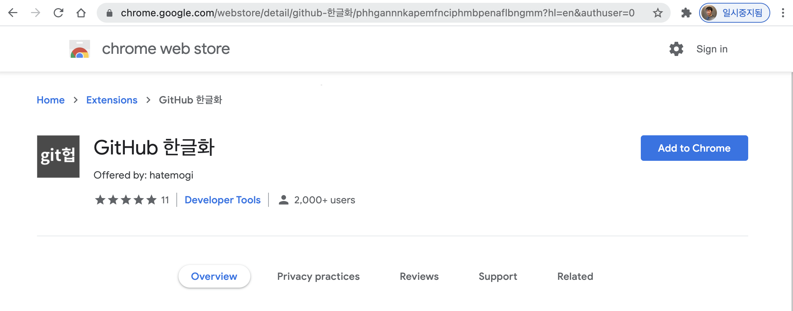

# GitHub 한글화 실험 프로젝트

> "개발자가 자주 쓰는 GitHub 웹사이트를 한글화 하면 친숙해서 좋지 않을까?"

위 질문에서 시작한 실험 프로젝트입니다. 실제로 한글화를 해보고 직접 써봐서 그 답을 찾아보고자 합니다. GitHub을 한글화 하는 **크롬 확장 프로그램**을 개발하고 있습니다.

## 스크린 샷


GitHub 한글화 크롬 확장 프로그램을 설치한 뒤, 평소 이용하는 GitHub에 방문하시면 한글로 번역되어 표시됩니다.

## 합리화

현대 개발자는 버전 관리 도구 Git을 필수적으로 사용합니다. 더불어 리모트 저장소 서비스를 중심으로 개발 프로젝트 호스팅을 하고 있는 GitHub도 많이 쓰고 있습니다.

개발자들은 영문만 지원하는 각종 도구와 웹 사이트를 일상적으로 사용하고 있기에, 영어 읽기에 큰 어려움이 없습니다. 따라서, 깃헙 웹사이트가 영어로 제공되더라도 쓰는데 문제가 없습니다.

하지만, 그럼에도 불구하고, 만약 깃헙 웹사이트를 한글로 접할 수 있다면, 더 친숙하고 편안하지 않을까 하는 생각에서 이 한글화 프로젝트를 시작하게 되었습니다. 과연 한글화를 해서 더 편안한지, 그래서 정말로 유용한 지 실험해 보도록 하겠습니다.

## 한글화 방안들

1. GitHub이 직접 다국어를 지원 - 깃헙이 자체적으로 다국어를 지원하고, 한국어 지원을 포함하는 것이 가장 바람직하고 확실합니다만, 아직 아쉽게도 다국어 지원이 없습니다. [도움말 사이트](https://help.github.com)는 일부 외국어를 지원하고 있으므로, 언젠가 한국어 지원이 된다면 가장 좋겠습니다.
1. 한국형 GitHub을 만드는 방법 - 완벽한 한국어 환경을 지원하기엔 가장 확실한 방법입니다만, GitHub 수준의 프로젝트 호스팅 서비스를 새로 만들어 내야 한다는 부담이 있습니다. 그리고, "한국형"에 대한 부정적 인식이 크다는 점을 무시할 수 없습니다. 어쩌면 오픈소스로 된 깃 저장소 서비스 프로젝트를 기준으로 한글화를 추가하는 게 현실적인 방법일 것 같기도 합니다.
1. GitHub API 이용 - GitHub에서 제공하는 API를 이용해서, 별도의 한국어 웹사이트 껍데기를 만들고, 내부적으로 GitHub 서비스를 이용하도록 하는 방법도 떠올려 보았습니다. 실현 가능성이 있다고 하더라도, 이용자가 github.com이 아닌 별도의 URL을 치고 들어와야 한다는 장애물이 있습니다.
1. **브라우저 확장 프로그램 이용** - 이 프로젝트에서 공략하고자 하는 방법입니다. 크롬 확장 프로그램을 이용해, 브라우저에 이미 잘 그려진 내용 중에서, 원문 텍스트를 일일이 한국어로 치환하는 방법입니다. 작업 수고가 (상대적으로) 매우 적게 들고, 현실성이 높습니다만, 몇 가지 단점이 있습니다.

하지만, 한글화 실험 목적에는 충분하다고 여겨 (4)방법으로 진행하겠습니다.

## 목표와 현황

* 1차 목표 - 깃헙 사이트에 적용해 쓸 수 있는 크롬 확장 프로그램을 구글 스토어에 공개
* 현재  7개 화면 번역 완료

## 이용 방법

크롬 웹 스토어에 등록되면, 여느 확장 프로그램과 같은 방법으로 설치하실 수 있습니다.



[크롬 웹 스토어 - GitHub 한글화 설치하러 가기](https://chrome.google.com/webstore/detail/github-%ED%95%9C%EA%B8%80%ED%99%94/phhgannnkapemfnciphmbpenaflbngmm)

위 확장 프로그램 페이지에서 "Chrome에 추가" 버튼을 누르시면 설치되며, 설치 후 평소처럼 GitHub에 방문하시면 됩니다.


## 어떻게 동작하는가?

크롬 브라우저 "확장 프로그램"을 이용자가 브라우저에 로드하면, 특정 사이트에 대해 별도로 자바스크립트 코드를 수행할 수 있습니다. 확장 프로그램 내에 자바스크립트 파일을 미리 포함해 둘 수 있고, 조건에 맞는 웹사이트에 방문 시 사이트 내용을 로드하며 실행하게 됩니다. 우리는 <https://github.com> 웹사이트에 방문하는 경우에, 확장 프로그램 안에 포함시켜둔 `github-ko.js` 파일을 자동으로 읽게 되며, 이 자바스크립트에서는, 화면 내에 DOM 요소들을 검색하여, 조건에 맞는 요소들의 텍스트를 한글로 치환하게 됩니다. 예를 들어, 저장소 탐색 화면에서 `commit`이라는 텍스트를 `커밋`으로 번역하는 자바스크립트 코드는 이하와 같이 작성할 수 있습니다.

``` javascript
document.querySelectorAll('.repository-content .numbers-summary a').forEach(a => {
    if (/commits/.test(a.innerHTML)) {
        a.innerHTML = a.innerHTML.replace(/commits/, "커밋");
    }
});
```

구체적인 코드는 조금 더 복잡하지만 아이디어 설명을 위해 간단히 적었으며, 실제 코드도 동작 원리는 같습니다. 번역하고자 하는 문구를 담고 있는 DOM 노드를 CSS 셀렉터로 찾아서, 해당 노드가 담고 있는 텍스트 노드의 문자열을 정규식으로 검사하여, 일치하는 부분을 한국어로 변환하는 일을 합니다. 다소 부정확한 방식이지만, 원하는 목적을 달성하기에는 충분하고 간단한 방법이라고 생각합니다.

## 추가 한글화 요청 방법

확장 프로그램을 이용하던 중, 추가로 한글화 되었으면 하는 부분이 있다면, [이슈](https://github.com/hatemogi/github-ko-ext/issues/new)로 등록합니다. 이슈 등록 시 해당 화면의 URL과 원문 텍스트, 그리고 번역을 기대하는 한글 텍스트를 기재해주시면 감사하겠습니다.

## 한계

지금 방식은, 깃헙 영문 사이트에 보이는 내용을 주먹구구식으로 치환하고 있기에, (1) 모든 페이지를 번역하기 어렵습니다. (2) 깃헙 영문 사이트의 외양이 바뀌면, 한글 번역이 잘 되지 않을 수도 있습니다. 그때마다 수작업으로 대응해야 하는 어려움이 있습니다. 또, (3) 단순한 텍스트 치환이기에, 긴 문장이나, 문장 내에 별도의 DOM 요소가 추가로 있는 경우에는 한국어 번역이 어렵습니다. (4) 또, 원문 화면이 다 그려진 후에 별도로 번역을 진행하므로, 짧은 순간동안 원문이 보이다가 후에 한글화로 보이는 문제도 있습니다. (5) 이 확장 프로그램을 설치한 환경에서만 한글로 표기됩니다.

이러한 명백한 기능적 한계점들을 안고 시작하지만, 실험 목적을 달성하는 데에는 충분하리라 기대합니다.

## 프로젝트 종료 조건

다음의 조건 중 하나 이상 만족되면 프로젝트 소유자의 판단으로 종료합니다.

1. 깃헙 서비스가 자체적으로 한국어를 포함한 다국어를 지원하게 된 경우
1. 깃헙 웹 사이트 한글화가 무의미하다는 결론이 난 경우
1. 프로젝트에 주도자의 의욕이 현저히 떨어진 경우

## 고마운 분들

이 프로젝트는 다음 분들의 도움을 받았습니다. 여러분의 도움을 바랍니다.

* [김대현(@hatemogi)](https://github.com/hatemogi) - 프로젝트 시작
* [D2Coding 글꼴](https://github.com/naver/d2codingfont) - 코딩 글꼴 공개
* [황승현(@hsh2001)](https://github.com/hsh2001)

감사합니다.
